# Windows 下开发环境配置

## CodeBlocks 的安装
### 下载

打开 http://www.codeblocks.org/downloads/binaries/#imagesoswindows48pnglogo-microsoft-windows 选择安装包。注意选择 `codeblocks-xx.xxmingw-setup.exe` 格式的安装包，即带有 `mingw` 且是 `exe` 后缀的安装包。

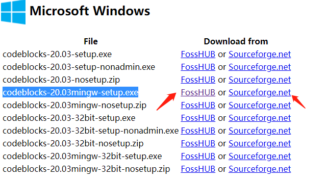

### 安装

双击下载好的文件，开始安装。如果提示需要权限，点击“是”。

1. 点击 **Next**

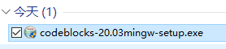

2. 点击 **I Agree**

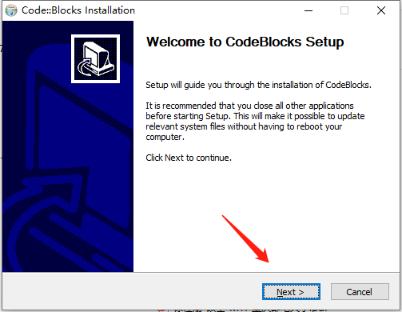

3. 点击 **Next**

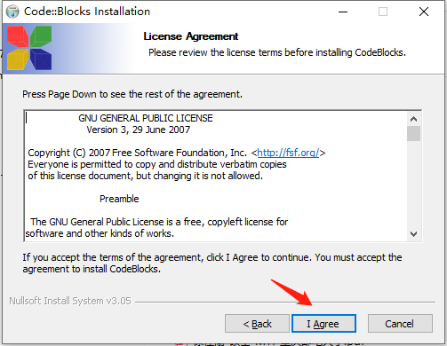

4. 点击 **Next**

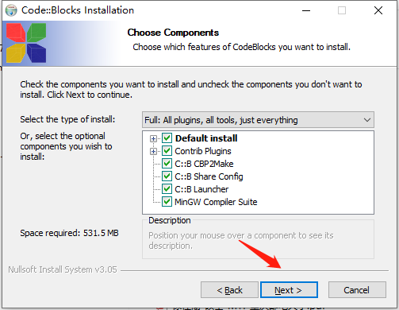

5. 点击 **Install**

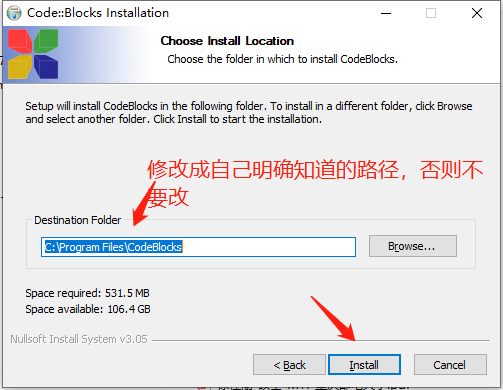

6. 开始安装

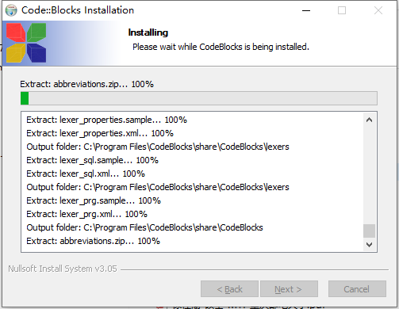

7. 上一步完成，会提示是否现在就启动 CodeBlocks。此处可以点“否”（点“是”会直接启动 CodeBlocks）。

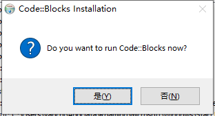

8. 在最后的对话框点击 “Finish”，完成安装。

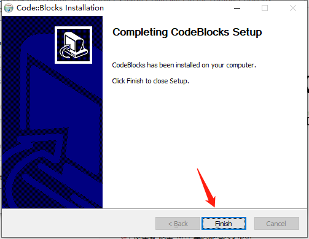

## CodeBlocks 的启动设置

1. 第一次启动，可能会弹出以下对话框，如果出现，按图中所示选择，点击 “OK” 即可。

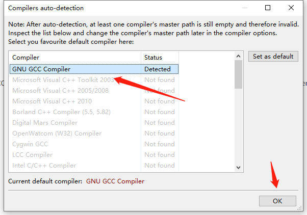

2. 选择 `File->New->Project` 开始创建一个新的工程。

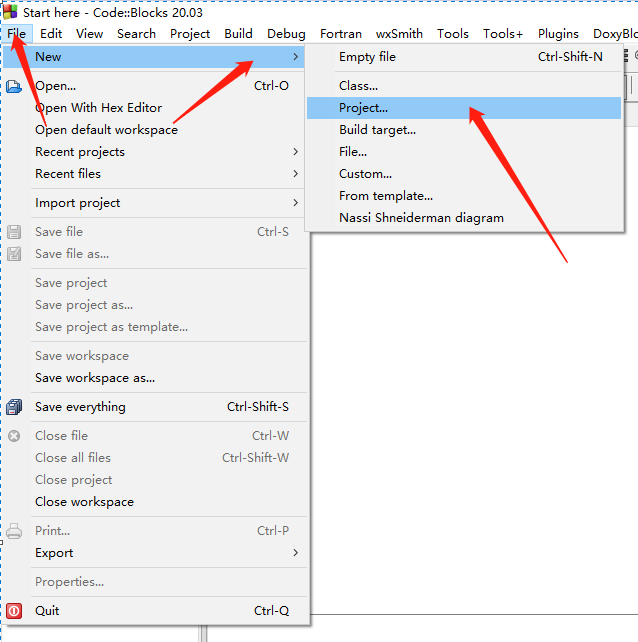

3. 在下拉菜单中选择 “Console”

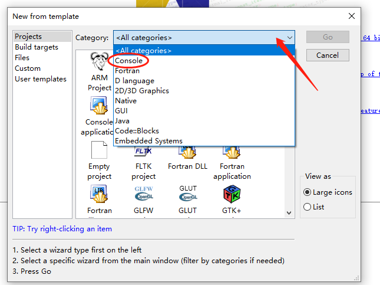

4. 选择 “Console application”，点击 “Go”

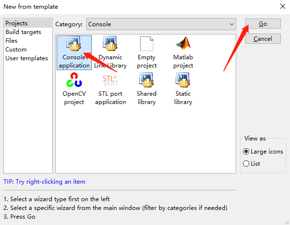

5. 选择 “Next”

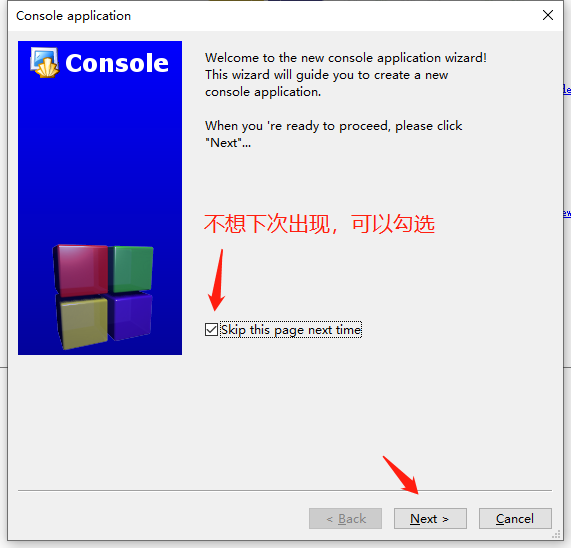

6. 选择 “C++”，点击 “Next”

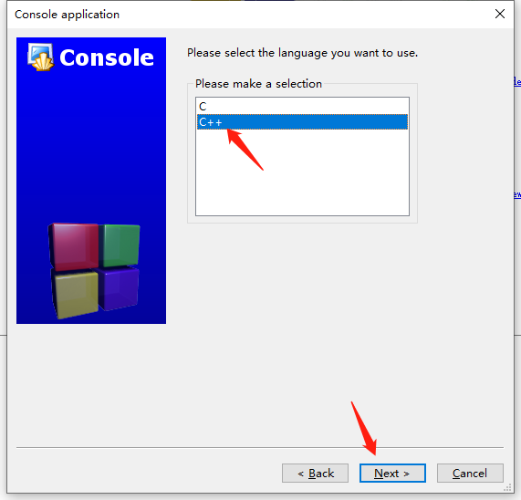

7. 点击 “Folder to create project in” 一栏旁边的 “...”，选择一个空目录。
在 “Project title” 一栏填写项目名称（名称可以任意，最好是英文）。
然后点击 “Next”。

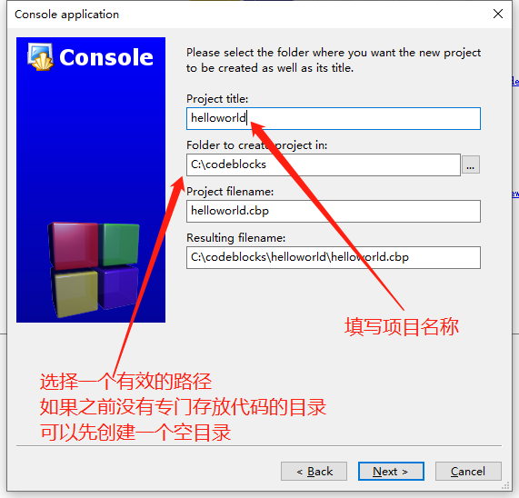

8. 点击 “Next”

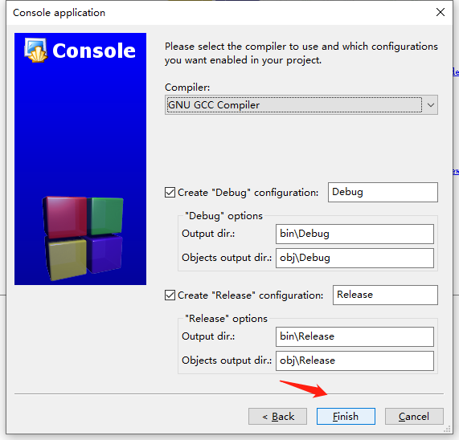

9. 出现类似如下界面，则说明创建项目成功。

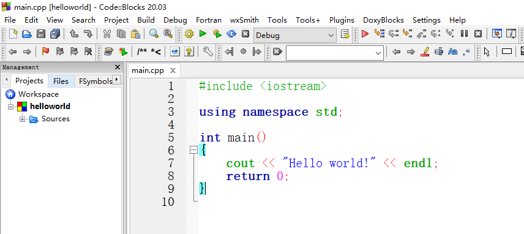